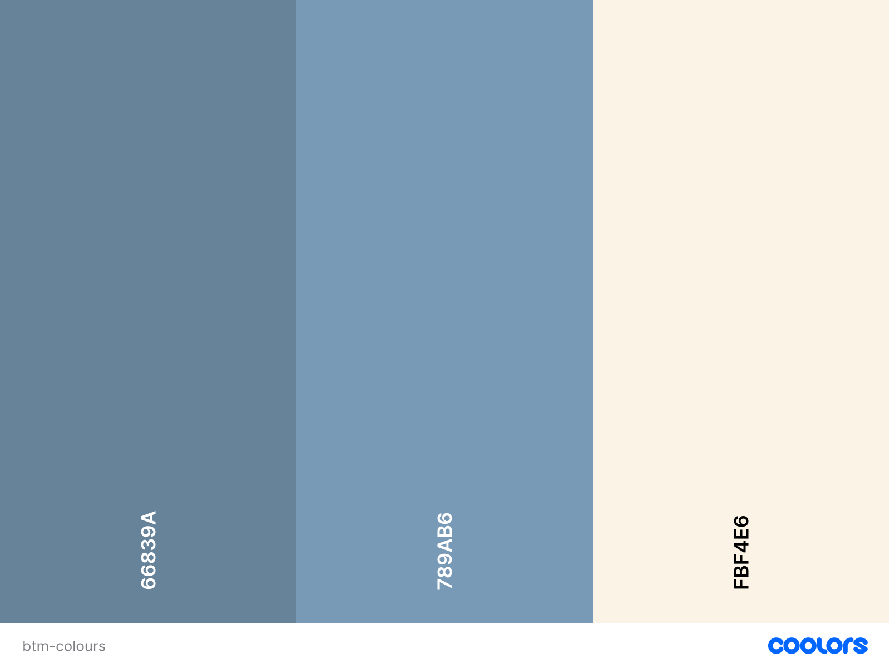
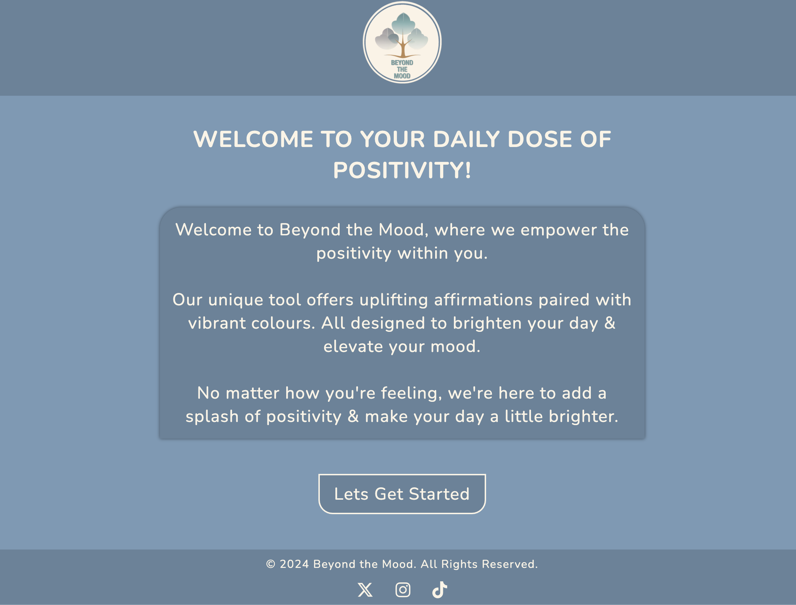

# BEYOND THE MOOD

This Positive Affirmation and Color Wheel app is designed to uplift your mood and bring positivity into your day. By seamlessly integrating the ZenQuotes API, it fetches and displays inspiring affirmations to motivate and encourage you. The app also features an interactive color wheel, allowing you to select colors that resonate with your current mood. The chosen color updates the background, creating a personalized and visually appealing experience. Additionally, with a built-in screenshot functionality powered by the `html2canvas` library, you can capture and save these moments of positivity, making it easy to revisit or share them with others. Whether you're looking for daily motivation or a splash of color to brighten your day, this app combines the power of positive words and color therapy into a simple, user-friendly tool.

## Table of Content

1. [User Stories](#user-stories)

2. [Visual Design](#visual-design)

3. [Features](#features)

4. [Technologies](#technologies)

5. [Testing](#testing)

6. [Deployment](#deployment)

7. [Credits](#credits)

8. [Author](#author)

## [User Stories](#user-stories)

### A SHORT BRIEF

Sometimes we dream to have a companion who personally uplifts our moods? Well, that idea is what my app/website is all about – a fun filled and inspiring corner of the interweb where sadness is shaken off, and happiness sought. By incorporating little-comedic touches here and there, loads of bright colors, plus a dose of positive energy, I intend to help the user smile away there clouding mood.

[USER VIEW]()

1.  As a person, I want to receive uplifting and galvanising colourings to help me shift my mood and attitude, so I can feel more fine and empowered during the day.

2.  As a consumer struggling with anxiety or depression, I need to get admission to a secure and supportive website wherein I can discover consolation and reassurance, so I can sense much less isolated.

3.  As a user seeking out a every day select-me-up, I want to discover a curated series of amusing and uplifting content material, along with wonderful affirmations so I can begin my day on a high word and experience extra energised and influenced.

## [Visual Design](#visual-design)

#### [FLOW CHART]()

This is a simple flow chart that outlines the orientation of the site and what way the user will navigate from section to section.

#### [WIREFRAMES]()

#### [FONT]()

I decided on the font Nunito for its mild, rounded corners, which I believe will create a experience of warmth and approachability upon arrival. By choosing a font with a softer side, I purpose to bring a sense of comfort and ease, making users feel extra comfortable as they navigate the website.

[Google Fonts - Nunito](https://fonts.google.com/specimen/Nunito?preview.text=Beyong&query=Nunito)

#### [ICONS]()

The icons I used are from the [Fontawesome](https://fontawesome.com/) Icon library using the <<i>i</i>> tag. They are utalised in the footer.

- X / Twitter
- Instagram
- TikTok

#### [COLOURS]()

I utilised the coloration palette generator [coolors](https://coolors.co) to create a harmonious and calming color scheme for the site. I aimed to create a welcoming surroundings via restricting the palette to a few key colors, warding off overwhelming visual stimuli. To attain the deep blue tone #66839A, I integrated the usage of a transparent (rgba(3, 3, 3, 0.153)) to obtain the desired impact.

#### [LOGO]()

The logo was created with the help of [deep AI](https://deepai.org/machine-learning-model/text2img) image generator. I wanted the user to be greeted with a grounding picture as there first impression of of the site. The colour tones and tree give the calming grounding feel that i was looking for. My goal is to make the user feel trust in the site, and I am confident that the logo will set that tone.

## [Features](#features)

### Existing Features

[HOME PAGE]()

On the landing page I decided to greet the user with an upbeat message that explains what the app/ site will offer. I hope for the user to be feeling a little bit more positive and intrigued before they navigate to the application part of the site.

 

When they hover over the 'Lets Get Started' button it has an effect of lighting up. This is to give the impression of lighting the way for the user to follow. The navigation for the button is controlled by <code>addEventListener('click' function {})</code>

 

[COLOUR WHEEL AREA]()

- **The affirmation section**

- **The Screenshot Section**

  - This section will allow the user to take a screenshot of the affirmation and colour, so they can keep it with them.

### Features Left to Implement

- Another feature idea:

## [Technologies](#technologies)

## [Testing](#testing)

### Validator Testing

### Unfixed Bugs

## Deployment

## Credits

### Content

### Media

## Other General Project Advice
