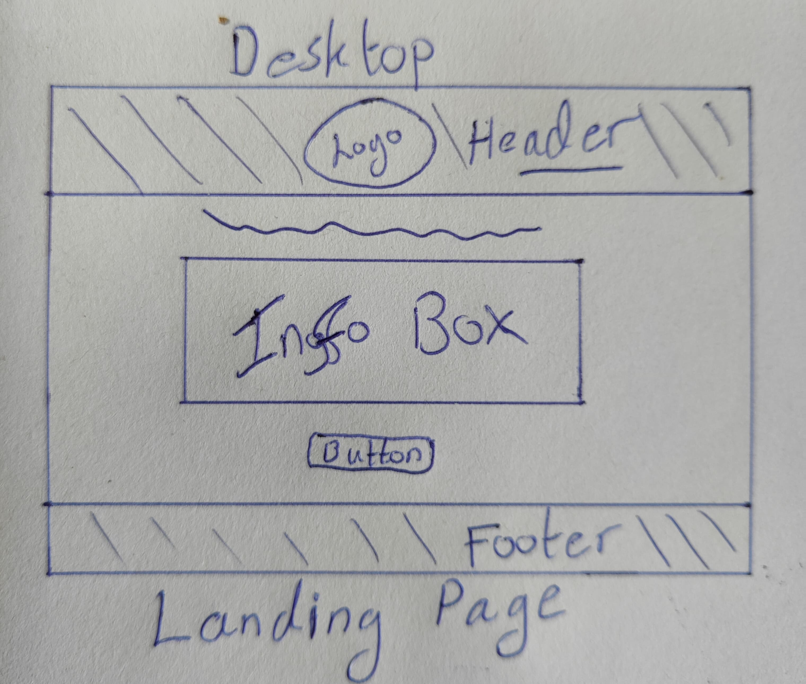
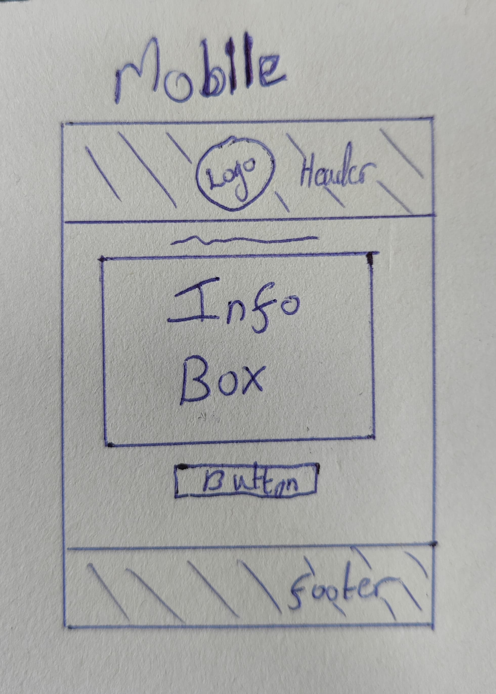
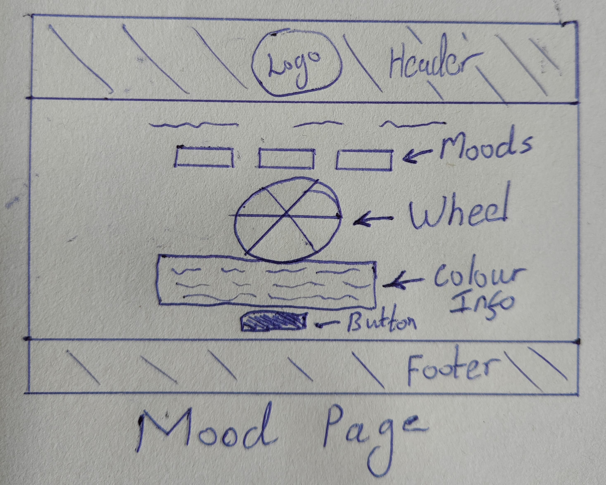
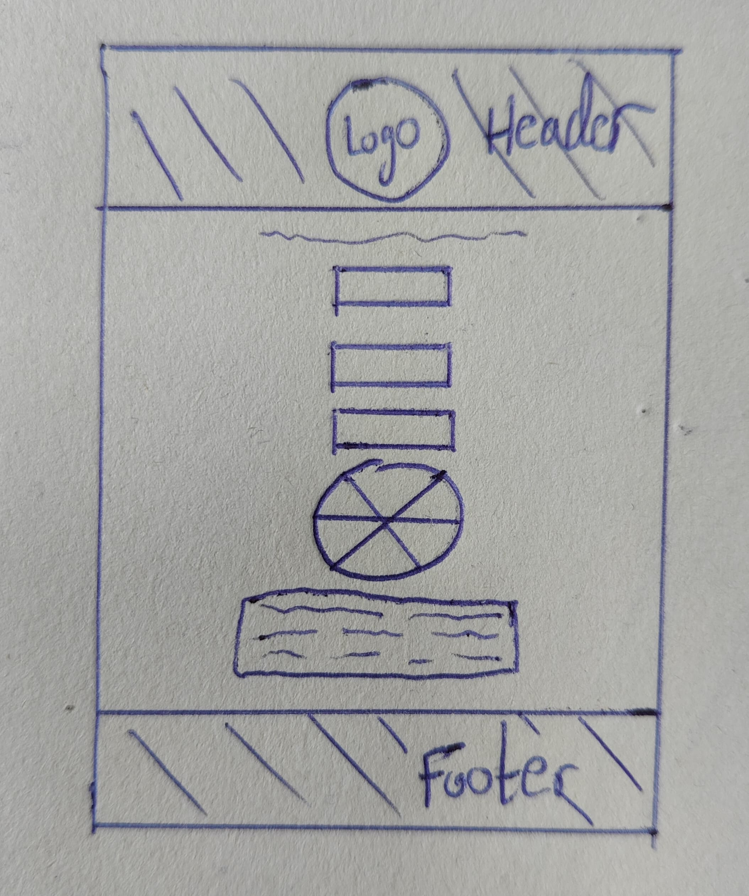
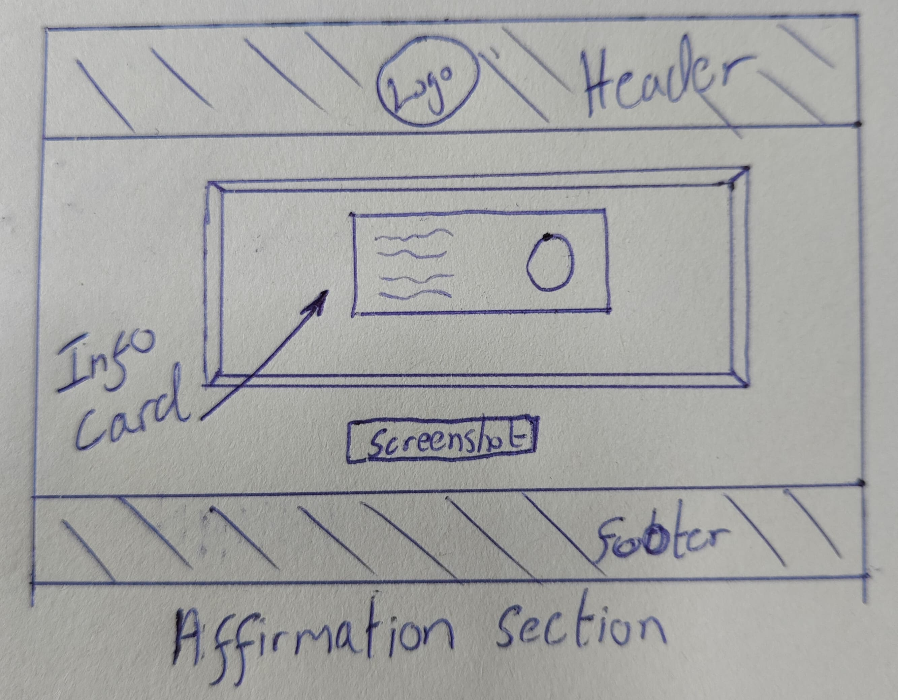

# BEYOND THE MOOD

This Positive Affirmation and Color Wheel app is designed to uplift your mood and bring positivity into your day. By seamlessly integrating the ZenQuotes API, it fetches and displays inspiring affirmations to motivate and encourage you. The app also features an interactive color wheel, allowing you to select colors that resonate with your current mood. The chosen color updates the background, creating a personalized and visually appealing experience. Additionally, with a built-in screenshot functionality powered by the `html2canvas` library, you can capture and save these moments of positivity, making it easy to revisit or share them with others. Whether you're looking for daily motivation or a splash of color to brighten your day, this app combines the power of positive words and color therapy into a simple, user-friendly tool.

## Table of Content

  
1. <a href="#user-stories">User Stories</a>

  <ul>
    <li><a href="#user-view">User View</a></li>
  </ul>

  
2. <a href="#visual-design">Visual Design</a>

  <ul>
    <li><a href="#flow-chart">Flow Chart</a></li>
    <li><a href="#wireframes">Wireframes</a></li>
    <li><a href="#font">Font</a></li>
    <li><a href="#icons">Icons</a></li>
    <li><a href="#colours">Colours</a></li>
    <li><a href="#logo">Logo</a></li>
  </ul>

  
3. <a href="#features">Features</a>

  <ul>
    <li><a href="#home-page">Home Page</a></li>
    <li><a href="#colour-wheel-area">Colour Wheel Area</a></li>
    <li><a href="#affirmation--screenshot">Affirmation & Screenshot</a></li>
  </ul>

  
4. <a href="#technologies">Technologies</a>

  <ul>
    <li><a href="#technology-1">Technology 1</a></li>
    <li><a href="#technology-2">Technology 2</a></li>
    <!-- Add more technologies as needed -->
  </ul>

  
5. <a href="#testing">Testing</a>

  <ul>
    <li><a href="#unit-tests">Unit Tests</a></li>
    <li><a href="#integration-tests">Integration Tests</a></li>
    <!-- Add more testing items as needed -->
  </ul>

  
6. <a href="#deployment">Deployment</a>

  <ul>
    <li><a href="#deployment-steps">Deployment Steps</a></li>
    <li><a href="#environment-setup">Environment Setup</a></li>
    <!-- Add more deployment items as needed -->
  </ul>

  
7. <a href="#credits">Credits</a>

  <ul>
    <li><a href="#contributor-1">Contributor 1</a></li>
    <li><a href="#contributor-2">Contributor 2</a></li>
    <!-- Add more credits as needed -->
  </ul>

  
8. <a href="#author">Author</a>

  <ul>
    <li><a href="#author-name">Author Name</a></li>
    <li><a href="#author-bio">Author Bio</a></li>
    <!-- Add more author items as needed -->
  </ul>

## [User Stories](#user-stories)

### A SHORT BRIEF

Sometimes we dream to have a companion who personally uplifts our moods? Well, that idea is what my app/website is all about – a fun filled and inspiring corner of the interweb where sadness is shaken off, and happiness sought. By incorporating little-comedic touches here and there, loads of bright colors, plus a dose of positive energy, I intend to help the user smile away there clouding mood.

#### [USER VIEW](#user-view)

1.  As a person, I want to receive uplifting and galvanising colourings to help me shift my mood and attitude, so I can feel more fine and empowered during the day.

2.  As a consumer struggling with anxiety or depression, I need to get admission to a secure and supportive website wherein I can discover consolation and reassurance, so I can sense much less isolated.

3.  As a user seeking out a every day select-me-up, I want to discover a curated series of amusing and uplifting content material, along with wonderful affirmations so I can begin my day on a high word and experience extra energised and influenced.

## [Visual Design](#visual-design)

#### [FLOW CHART](#flow-chart)

This is a simple flow chart that outlines the orientation of the site and what way the user will navigate from section to section.

#### [WIREFRAMES](#wireframes)

|                                           Desktop                                            |    Pages    |                                           Mobile                                            |
| :------------------------------------------------------------------------------------------: | :---------: | :-----------------------------------------------------------------------------------------: |
|         |   Landing   |         |
|         |    Mood     |         |
|  | Affirmation |  |

#### [FONT](#font)

I decided on the font Nunito for its mild, rounded corners, which I believe will create a experience of warmth and approachability upon arrival. By choosing a font with a softer side, I purpose to bring a sense of comfort and ease, making users feel extra comfortable as they navigate the website.

[Google Fonts - Nunito](https://fonts.google.com/specimen/Nunito?preview.text=Beyong&query=Nunito)

#### [ICONS](#icons)

The icons I used are from the [Fontawesome](https://fontawesome.com/) Icon library using the <<i>i</i>> tag. They are utalised in the footer.

- X / Twitter
- Instagram
- TikTok

#### [COLOURS](#colours)

I utilised the colouration palette generator [coolors](https://coolors.co) to create a harmonious colour scheme for the site. I aimed to create a welcoming surroundings via restricting the palette to a few key colours, warding off overwhelming visual stimuli. To attain the deeper blue tone <code>#2A495F</code>, I integrated the usage of a transparent <code>rgba(3, 3, 3, 0.2)</code> to obtain the desired impact.

#### [LOGO](#logo)

The logo was created with the help of [deep AI](https://deepai.org/machine-learning-model/text2img) image generator. I wanted the user to be greeted with a grounding picture as their first impression of of the site. The colour tones and tree give the calming grounding feeling I was looking for. My goal is to make the user have trust in the site, and I am confident that the logo will set that tone.

## [Features](#features)

### Existing Features

#### [HOME PAGE](#home-page)

On the landing page I decided to greet the user with an upbeat message that explains what the app/ site will offer. I hope for the user to be feeling a little bit more positive and intrigued before they navigate to the application part of the site.

 

When they hover over the 'Lets Get Started' button it has an effect of lighting up. This is to give the impression of lighting the way for the user to follow. The navigation for the button is controlled by <code>addEventListener('click' function {})</code>

 

#### [COLOUR WHEEL AREA](#colour-wheel-area)

This is the colour wheel area of the <code>mood.html</code> page where the user is greeted with a small message asking them what mood is affecting their day.

<table "width=100%; table-layout: fixed;">
  <tr>
    <th style="width: 30%;">Image</th>
    <th style="width: 15%;">Feature</th>
    <th style="width: 55%;">Info</th>
  </tr>
  <tr>
    <td></td>
    <td>Wheel page</td>
    <td>The colour wheel area is set out with the mood buttons wheel section and the return message area.</td>
  </tr>
  <tr>
    <td></td>
    <td>Mood Selection</td>
    <td>The user picks from six different moods that can affect us all every day. Here we use <code>fetch('coloursAndFeelings.json')</code> to get the info from the JSON. The mood button corresponds to the same mood in the JSON.</td>
  </tr>
  <tr>
    <td></td>
    <td>Colour Wheel</td>
    <td>After the user selects a mood, the wheel applies <code>applyColours(Object.values(coloursAndFeelings[mood]));</code> Each mood has 6 different colours.</td>
  </tr>
  <tr>
    <td></td>
    <td>Message & colour display</td>
    <td>When the spin class finishes with the <code>setTimeout(() => {})</code> function, the user is presented with a message relating to the random colour. This is achieved with the <code>moodColourMsg()</code> function.</td>
  </tr>
  <tr>
    <td></td>
    <td>Onwards Button</td>
    <td>The onwards button takes the user to the affirmation section of the mood app. This is controlled with an <code>onwardsBtn.addEventListener('click', function () {})</code>. It also gives the user a feel of lighting the way, the same as the button on the home page.</td>
  </tr>
</table>

#### [AFFIRMATION & SCREENSHOT](#affirmation--screenshot)

This section is accessed through the Onwards Button where the mood container is replaced by container2. This is archived with

      mood.style.display = 'none';
      affirmation.style.display = 'flex';

within an <code>addEventListener('click', function () {});</code>.

This section also allow the user to take a screenshot of the affirmation and colour, so they can keep it with them.

<table "width=100%; table-layout: fixed;">
  <tr>
    <th style="width: 30%;">Image</th>
    <th style="width: 15%;">Feature</th>
    <th style="width: 55%;">Info</th>
  </tr>
  <tr>
    <td></td>
    <td>Affirmation greeting</td>
    <td>The use is encouraged to click the button we use the <code>fetchAffirmation()</code> function to generate the card.</td>
  </tr>
  <tr>
    <td></td>
    <td>Final Card</td>
    <td>The user then receives their card with the quote, colour and positive word. They click the screen hot button which save there card to keep with them. This is achieved with the built in function <code> html2canvas</code>.</td>
  </tr>
  <tr>
    <td></td>
    <td>Thank you message</td>
    <td>After the user has taken the screenshot they are thanked for using the app. This is controlled with <code>affirmationBtn.addEventListener('click', function () {});</code> function. From there the user can return to the home screen.</td>
    
  </tr>
</table>

### Other Features that I would like to Implement:

- <b>Idea 1:</b> I would like to add a feature that allows the user to share their card on social media. This would be a great way to spread the positivity and share the app with others.
    
- <b>Idea 2:</b> One that allows the user to save their favourite cards to a gallery. This would be a great way for the user to keep track of their favourite cards.
    
- <b>Idea 3:</b> Allow the user to keep track of their mood and affirmations. This would be a great way for the user to see how their mood has changed over time.

## [Technologies](#technologies)

### Technology

- ### Languages

  [HTML](https://www.w3schools.com/html/) - The markup language used to create the structure of the site. 
  [CSS](https://www.w3schools.com/css/) - The styling language I used to style the site. 
  [JavaScript](https://www.w3schools.com/js/) - The programming language to make the site interactive.

- ### Platforms

  [GitPod](https://www.gitpod.io/) - The platform I used to write the code and deployment. 
  [Github](https://github.com/) - The platform I used to store the code and deploy the site. 
  [VS Code](https://code.visualstudio.com/) - IDE for code editing / project development.

- ### Other Tools

  [Font Awesome](https://fontawesome.com/) - The icon library I used to add icons to the site. 
  [DeepAI](https://deepai.org/chat) - The image generator I used to create the logo. 
  [Favicon Generator](https://favicon.io) - Create favicons needed. 
  [Coolors](https://coolors.co/) - The colour palette generator I used to create the colour scheme. 
  [ZenQuotes API](https://zenquotes.io/) - The API I used to fetch the affirmations. 
  [html2canvas](https://html2canvas.hertzen.com/) - The library I used to add the screenshot functionality to the site. 
  [Google Fonts](https://fonts.google.com/) - The font library I used to add the font to the site.

## [Testing](#testing)

### Validator Testing

### Unfixed Bugs

## Deployment

## Credits

### Content

### Media

## Other General Project Advice
